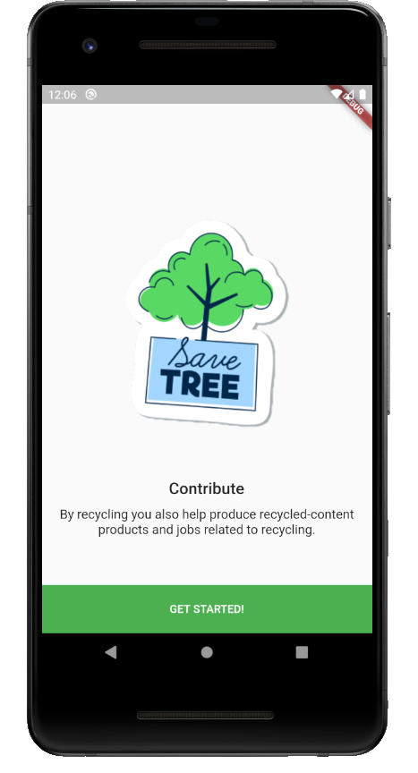
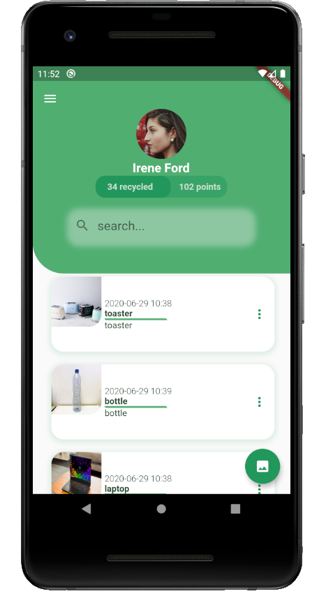
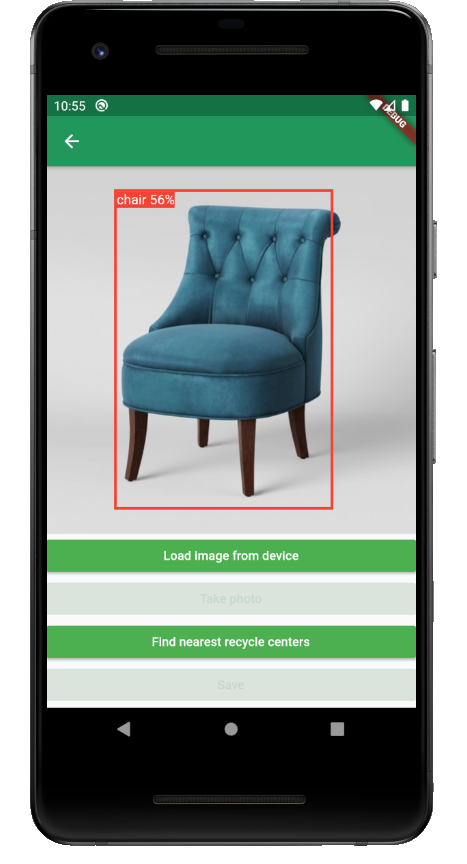
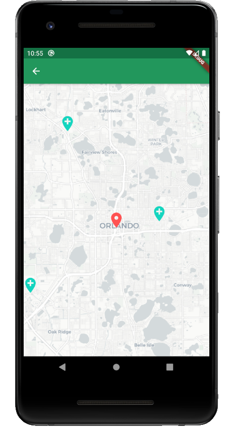

# Geopivot Mobile App - Recycling Centers and Services Mobile App

 

## Check out our presentation movie trailer :)

# Pitch

GeoPivot is powered by AI, Machine Learning, [earth911.com](earth911.com) data and mobile technologies to bring the convenience of recycling to people's homes.

## Additional Information

Have you ever wondered how many waste are generated worldwide. A recent article from Recycling International states that more than 2 billion tonnes of municipal solid waste are generated worldwide per annum and only less than 20% of this is recycled.

In the top 20 countries for waste generator per capita worldwide, the US ranked 12th place with each citizen producing an average of 808kg per year. About 80% of what Americans throw away is recyclable, yet the recycling rate is only 28%.
It begs the question to ask why people are not doing more to recycle their waste?

First, it is difficult to identify what can and cannot be recycled. There are so many different kinds of paper goods, plastics, and metals, and worst of all, so many things that are combinations of materials that no list could possibly include every possible case.

Secondly, each recycle centre have their specific regulations depending on their locations and can be challenging for people to keep up.

GeoPivot project addresses these recycling woes. The project combines the power of Machine Learning, the vast recycling centre database from earth911, firebase - Google's mobile platform for quick app deployment and other technologies to bring the convenience of recycling to people's homes

Worldwide it is difficult to identify what can and cannot be recycled and where.
GeoPivot makes recycling easier, allowing users to take/upload pictures with mobile phones. It uses Tensorflow object detection, Earth911 data, Flutter maps to enable accurate prediction of images for recycling and show nearest recycle centre. The application is secure, using Firebase authentication for email/password and Goole sign-in. GeoPivot is tested and deployed to both Andriod and ios platforms.

## Tags

Computer Vision, Flutter, Firebase, Earth911, Machine Learning, Object Detection, Tensorflow, Andriod, Map, Recycle, YOLOV, Street Map

## Technical Details

* for Object Detection we have integrated Tensorflow Lite TiniyYoloV2
* For data-models, stubs and explorations we  have used Earth911 API
* Maps are supported by Flutter Map with Open Street Maps
* for Authentication we use  Firebase Authentication with supported flows for Email/Password  and Google sign-in
* For state management we’ve implemented the provider pattern
* We are sharing a theme cross the entire app to enable easier customisations 
* The code has been structured into small manageable widgets of different types
* Deployed and tested on both iOS and Android platforms

## Development notes 

### iOS
- include firebase updated plist into the credentials folder: `ios/credentials/GoogleService-Info.plist`
- in XCode, on the left hand side select the `GoogleService-Info.plist` under Runner and map it to the above location
- in Project > Runner > set Compile Sources As : `Objective-C++`
- in Project > Runner set Project Format to `11.0` and iOS Deployment Target to `11.0`